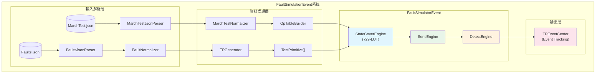
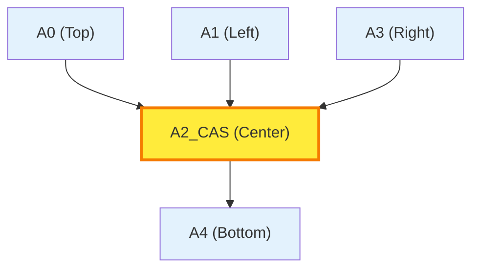
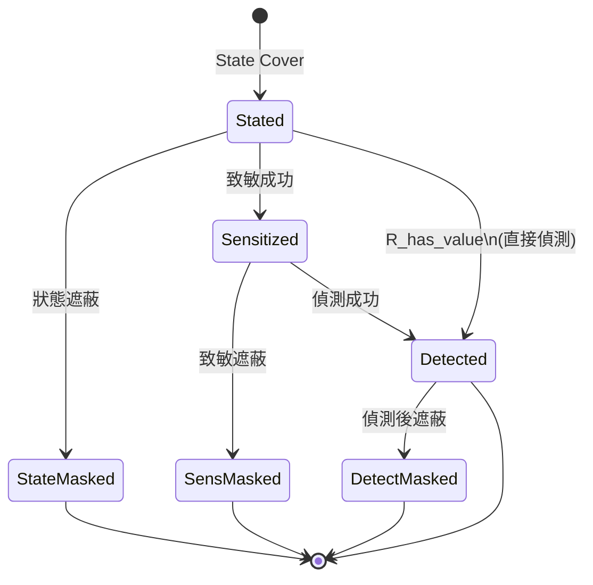
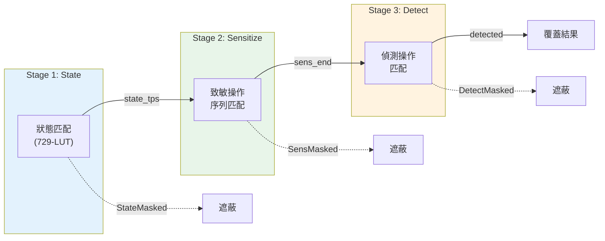
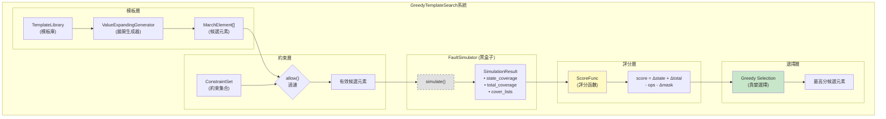
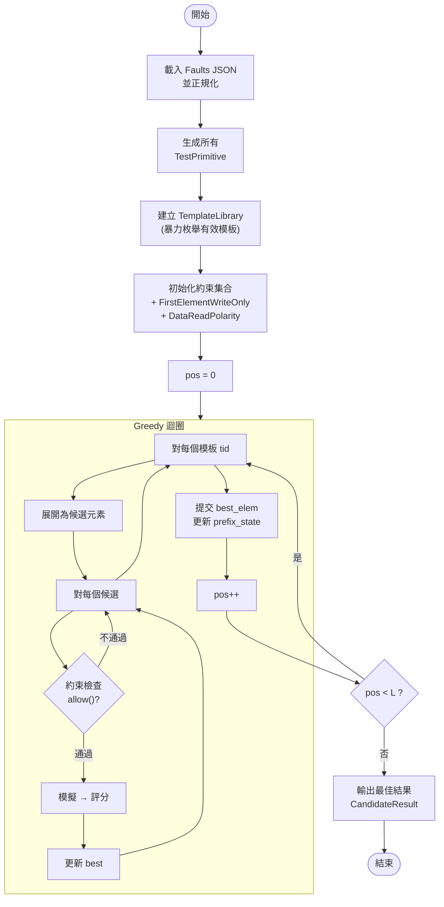
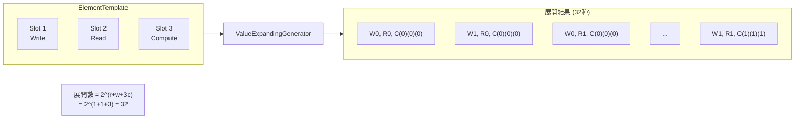
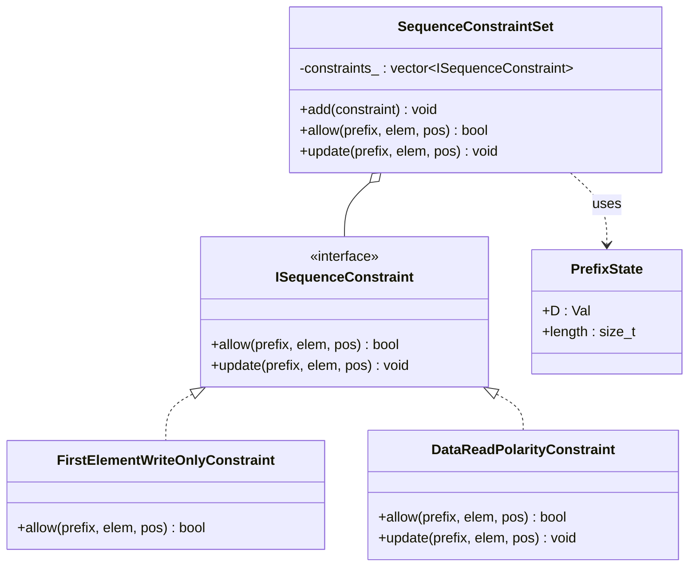
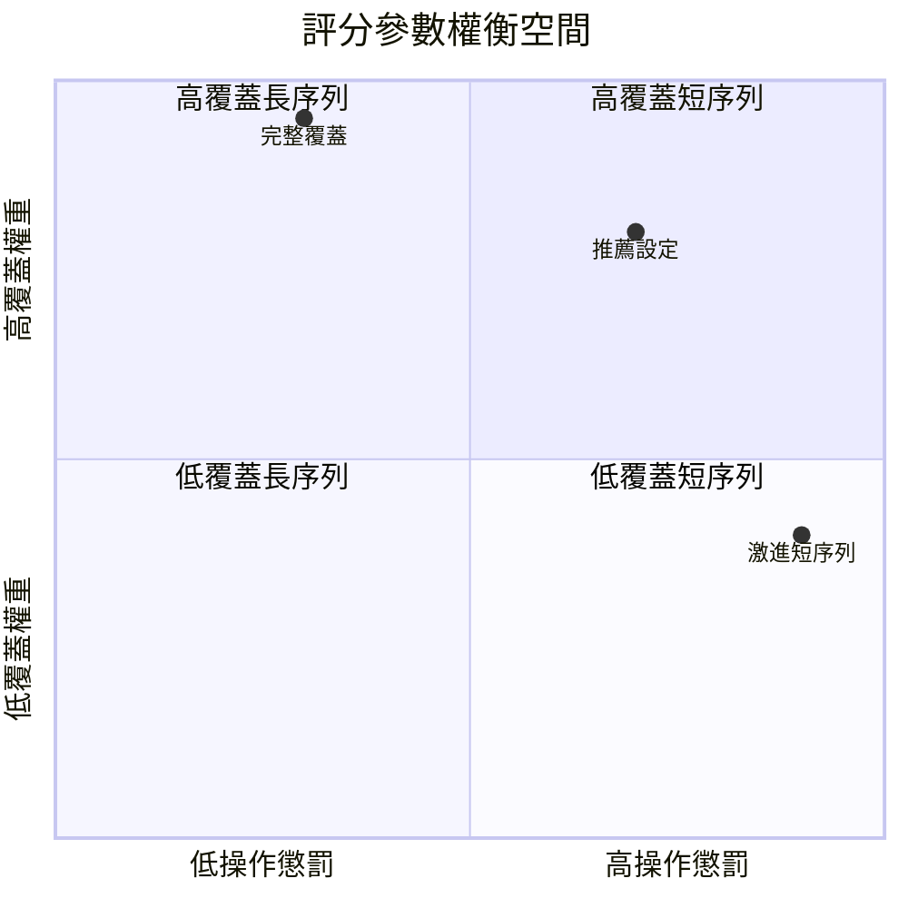
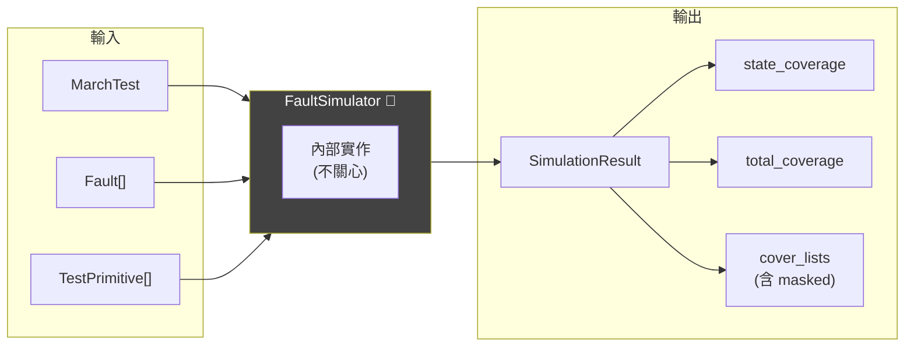

# 系統架構圖 (Mermaid)

本文件包含 FaultSimulationEvent 與 Greedy Template Search 系統的架構圖，使用 Mermaid 格式繪製。

---

## 1. FaultSimulationEvent 系統架構

---

## 2. Cross-Shape 五單元架構

**說明**：
- `A2_CAS` 是受測單元 (Cell Under Test)
- `A0`, `A4` 是同列的上下鄰居 (用於跨列 CFds 故障偵測)
- `A1`, `A3` 是同行的左右鄰居 (用於同列 CFds 故障偵測)

---

## 3. TPEvent 事件狀態機

---

## 4. 三階段流水線

---

## 5. Greedy Template Search 系統架構

---

## 6. Greedy 搜尋流程

---

## 7. 模板值展開流程

---

## 8. 約束系統架構

---

## 9. 評分函數權重效果

---

## 10. FaultSimulator 黑盒子視角

---

*文件版本：1.0*  
*最後更新：2025-12-22*
